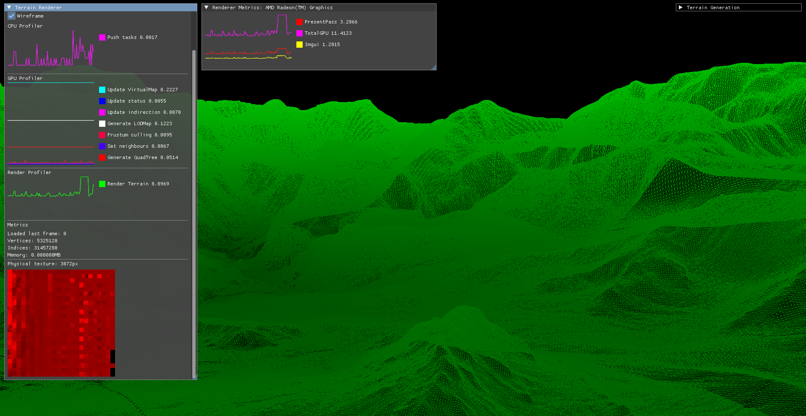
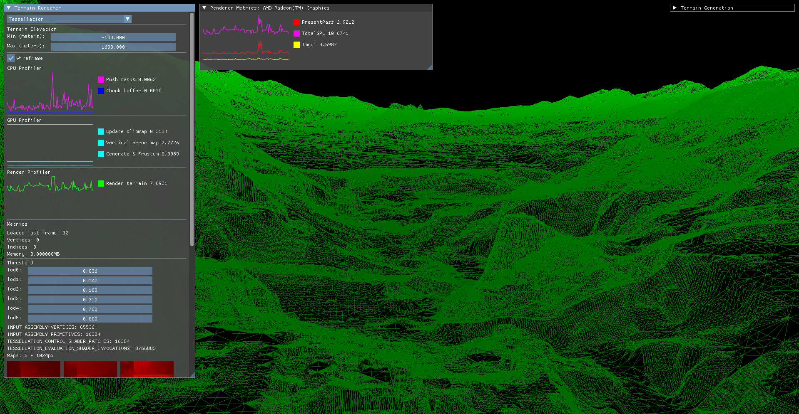

Vulkan Implementation of Terrain Rendering Techniques

This repository explores multiple terrain rendering techniques implemented in Vulkan, each inspired by real-world engines and presentations:

1. **QuadTree-based terrain rendering** (Far Cry 5)  
   Based on the GDC talk [*Terrain Rendering in Far Cry 5*](https://www.gdcvault.com/play/1025261/Terrain-Rendering-in-Far-Cry).  
   Implements a level-of-detail system using a quadtree structure for efficient terrain rendering and culling.



2. **Clipmap terrain rendering**  
   Uses concentric LOD rings centered around the camera. 

3. **Vertical error-based clipmap rendering**  
   Based on the GDC talk [*Landscape Creation and Rendering in REDengine 3*](https://gdcvault.com/play/1020394/Landscape-Creation-and-Rendering-in).  
   Improves clipmap LOD selection by incorporating vertical geometric error metrics for better visual fidelity.



4. **Brute-force tessellation-based rendering**  
   Uses hardware tessellation shaders to render terrain without LOD optimizations.  
   Simple but GPU-intensive — useful as a baseline or for prototyping.

Before rendering, the heightmap data must be serialized into a chunked format. This step converts a raw heightmap image into a set of LOD-aware terrain chunks.

Currently, the serialization process **only supports square images of size X × X** (e.g., 1024×1024, 2048×2048).

Use the following code to serialize the heightmap:

```cpp
SerializeChunkedSettings serializeSettings;
serializeSettings.MetadataFilepath = "path/to/metadatafile.metadata";
serializeSettings.RawdataFilepath = "path/to/rawdata.rawdata";
serializeSettings.ChunkSize = 128;
serializeSettings.LODs = 5;

HeightMapDiskProcessor diskProcessor("path/to/heightmap.png", 5);
diskProcessor.serializeChunked(serializeSettings);
